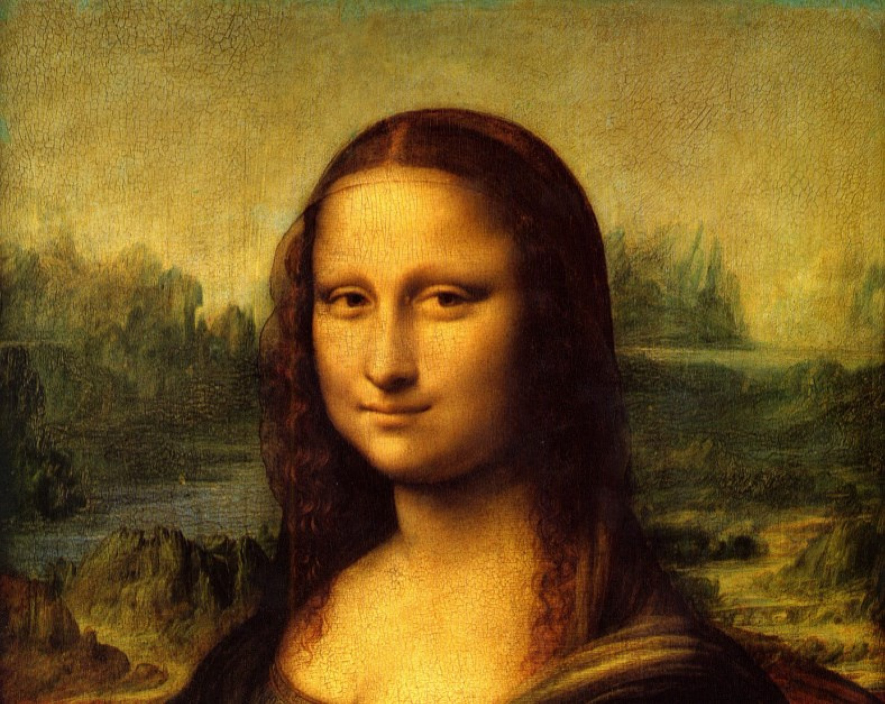
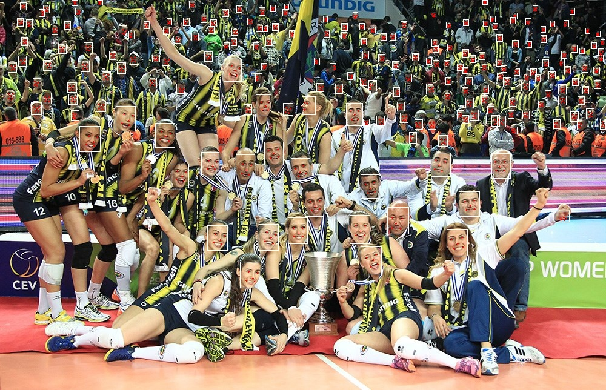
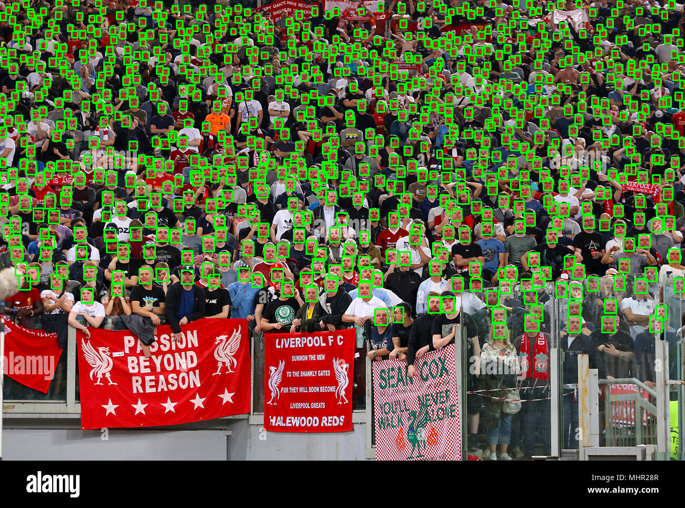
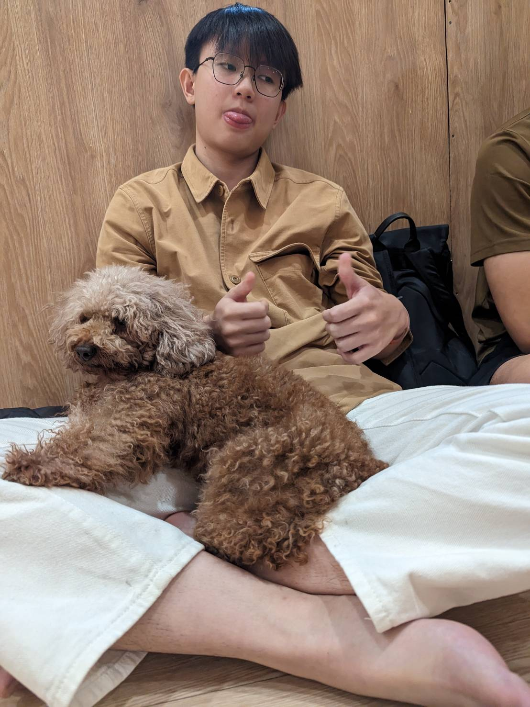

# Image Captioning With Face Recognition

This is the repository for Group 8's final project of the course Introduction to Machine Learning (11210CS 460200) provided at National Tsing Hua University by professor KUO, PO-CHIH.

The project uses GRIT and Deepface to combine Image Captioning and Face Recognition to aid visually impaired people in recognizing Images.

<p align="center">
  
</p>

## Set Up
Clone the project and install all the requirements in requirements.txt:
```
!pip  install -r grit/requirements.txt
```
Then download the spacy data
```
!python -m spacy download en
```

### Install the pre-trained model
Using the link below, download the pre-trained model that we use in our project.
Feel free to train it on your own, if you want to do so, head over to github of [1]
| Model                                           | Task             | Checkpoint                                                                                           |
|-------------------------------------------------|------------------|------------------------------------------------------------------------------------------------------|
| GRIT (using the object detector A)              | Image Captioning | [GG Drive link](https://drive.google.com/file/d/12tsI3Meka2mNLON-tWTnVJnUzUOa-foW/view?usp=share_link) |
| GRIT (using the object detector B)              | Image Captioning | [GG Drive link](https://drive.google.com/file/d/1jgEqNFuKcKg_RcG4Nq8bhWvCgzi6bjuD/view?usp=share_link) |

## How to run

## Output Examples
<p>
  <b>Captioning</b>
  <br>
  
  

  <b>Face recognition</b>
  <br>
  
  
  
  <b>Captioning + Face recognition</b>
  <br>
  
  
</p>

## Evaluation
We have decided to divide the evaluation process into three distinct parts. The first part focuses on image captioning, the second part concentrates on face recognition, and the third part assesses the overall performance of the model, which includes the image captioning feature with face recognition.

At present, there is no specific method to evaluate our entire model, so we will be doing it visually. As a result, we will present several outputs from the model for your perusal.

### GRIT Image Captioning
Below is the table for GRIT image captioning model offline and online evaluation. In all of the evaluation table for image captioning model, B-1, B-2, B-3, B-4, M, R, and C are metrics used to measure the performance of the model. B-1, B-2, B-3, and B-4 are short for BLEU-1, BLEU-2, BLEU-3, and BLEU-4, M is short for METEOR, R is short for ROUGE, C is short for CIDEr and S is short for SPICE. 

Offline Evaluation w/ VL pretraining:
| Methods       | V.E. (Type) // #V L (Data) | B-1 | B-4      | M        | R | C         | S        |
|---------------|:--------------------------:|:---:|----------|----------|---|-----------|----------|
| UVLP          | R // 3.0M                  | -   | 39.5     | 29.3     | - | 129.3     | 23.2     |
| Oscar(base)   | R // 6.5M                  | -   | 40.5     | 29.7     | - | 137.6     | 22.8     |
| VinVL*(large) | R // 8.9M                  | -   | **41.0** | 31.1     | - | 140.9     | 25.2     |
| SimVLM(huge)  | G // 1.8B                  | -   | 40.6     | **33.7** | - | **143.3** | **25.4** |

Offline Evaluation w/o VL pretraining:
| Methods        | V.E. (Type) | B-1  | B-4  | M    | R    | C     | S    |
|----------------|:-----------:|------|------|------|------|-------|------|
| SAT            |      G      | -    | 31.9 | 25.5 | 54.3 | 106.3 | -    |
| SCST           |      G      | -    | 34.2 | 26.7 | 55.7 | 114.0 | -    |
| RSTNet         |      G      | 81.8 | 40.1 | 29.8 | 59.5 | 135.6 | 23.0 |
| Up-Down        |      R      | 79.8 | 36.3 | 27.7 | 56.9 | 120.1 | 21.4 |
| RFNet          |      R      | 79.1 | 36.5 | 27.7 | 57.3 | 121.9 | 21.2 |
| GCN-LSTM       |      R      | 80.5 | 38.2 | 28.5 | 58.3 | 127.6 | 22.0 |
| LBPF           |      R      | 80.5 | 38.3 | 28.5 | 58.4 | 127.6 | 22.0 |
| SGAE           |      R      | 80.8 | 38.4 | 28.4 | 58.6 | 127.8 | 22.1 |
| AoA            |      R      | 80.2 | 38.9 | 29.2 | 58.8 | 129.8 | 22.4 |
| NG-SAN         |      R      | -    | 39.9 | 29.3 | 59.2 | 132.1 | 23.3 |
| GET            |      R      | 81.5 | 39.5 | 29.3 | 58.9 | 131.6 | 22.8 |
| ORT            |      R      | 80.5 | 38.6 | 28.7 | 58.4 | 128.3 | 22.6 |
| ETA            |      R      | 81.5 | 39.3 | 28.8 | 58.9 | 126.6 | 22.6 |
| M2 Transformer |      R      | 80.8 | 39.1 | 29.2 | 58.6 | 131.2 | 22.6 |
| X-LAN          |      R      | 80.8 | 39.5 | 29.5 | 59.2 | 132.0 | 23.4 |
| TCIC           |      R      | 81.8 | 40.8 | 29.5 | 59.2 | 135.4 | 22.5 |
| Dual Global    |     R+G     | 81.3 | 40.3 | 29.2 | 59.4 | 132.4 | 23.3 |
| DLCT           |     R+G     | 81.4 | 39.8 | 29.5 | 59.1 | 133.8 | 23.0 |
| GRIT           |     R+G     | 83.5 | 41.9 | 30.5 | 60.5 | 142.2 | 24.2 |
| GRIT+          |     R+G     | 84.2 | 42.4 | 30.6 | 60.7 | 144.2 | 24.3 |


## References
[1] GRIT: Faster and Better Image captioning Transformer https://github.com/davidnvq/grit
[2] deepface https://github.com/serengil/deepface
[3]
