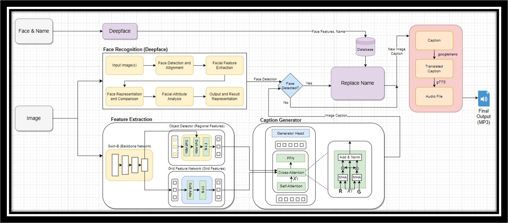
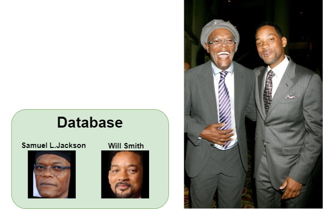
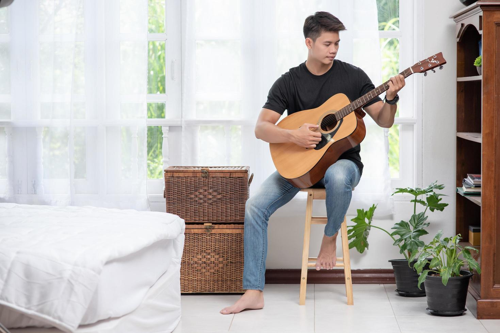
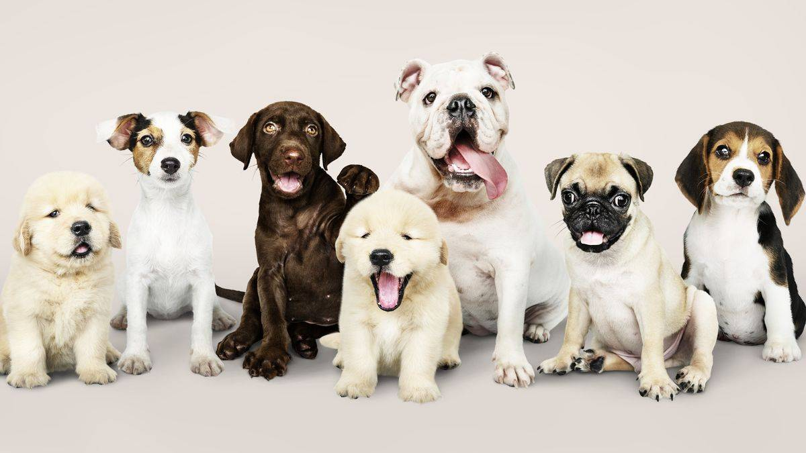

# Image Captioning With Face Recognition

Repository for the final project of Group 8 in the Introduction to Machine Learning (CS 460200) course offered by National Tsing Hua University by professor KUO, PO-CHIH.  The project uses GRIT and DeepFace to combine Image Captioning and Face Recognition to aid visually impaired people in recognizing Images.

<p align="center">
  
</p>

## Installation
### Requirements
* `Python` >= 3.9, `CUDA` >= 11.3
* `Pytorch` >= 1.12.0, `torchvision` >= 0.6.1
* Anaconda environment

### Setup
* Clone the project
  ```shell
  git clone https://github.com/kentselwyn/ML_ImageCaptioning.git
  ```
* Create an Anaconda environment
  ```shell
  conda create -n ICwFR python=3.9
  conda activate ICwFR
  ```
  **Troubleshoot**: If `conda activate ICwFR` fails, run `source activate ICwFR` instead to activate the environment.
* Install PyTorch (with the appropriate version for your CUDA)  
  Please refer to [PyTorch Installation Link](https://pytorch.org/) for further installation steps.
* Install all the required packages in `requirements.txt`
  ```shell
  cd ML_ImageCaptioning/
  pip  install -r requirements.txt
  ```
* Install CuDNN
  ```shell
  conda install cudnn
  ```
* Download the spacy data for vocab
  ```shell
  python -m spacy download en
  ```
* Install Deformable Attention
  ```shell
  cd grit/models/ops/
  python setup.py build develop
  python test.py
  ```

## Pretrained Weights
The pre-trained weights are provided by [1]. 
| Image Captioning Model | Checkpoint |
| -- | :--: |
| GRIT (using the Object Detector trained on Visual Genome) | [Drive link](https://drive.google.com/file/d/12tsI3Meka2mNLON-tWTnVJnUzUOa-foW/view?usp=share_link) |
| GRIT (using the Object Detector trained on COCO, Visual Genome, Open Images, and Object365) | [Drive link](https://drive.google.com/file/d/1jgEqNFuKcKg_RcG4Nq8bhWvCgzi6bjuD/view?usp=share_link) |

Place the pre-trained weights in the directory path `ML_ImageCaptioning/`

## Dataset
We use COCO 2014 for Image Captioning from [COCO Official Website](HTTP://cocodataset.org/#download) as our dataset. Download and place the dataset in the directory path:  
```
ML_ImageCaptioning/grit/coco/
├── annotations/
├── train2014/
├── val2014/
└── test2014/
```

## Running

### Command-Line Interface  
```
```

### Google Colaboratory  
```
```

### API
```
```

## Training  

## Fine-tuning  

## Qualitative Examples

Image Captioning and Facial Recognition  
| Image | Generated Caption |
| -- | -- |
|  | Elon Musk sitting at a table with a microphone. |  
|  | Lebron James holding a ball on a court. |  
|  | Samuel L. Jackson and Will Smith standing next to each other. |  

Image Captioning without Facial Recognition  
| Image | Generated Caption |
| -- | -- |
|  | A woman sitting on a chair holding a instrument. |  
|  | A man sitting on a chair playing a guitar. |  
|  | A group of dog standing in a line. |  
|  | A man is leaning over a pool table with balls. |  

## Evaluation
We have decided to divide the evaluation process into three distinct parts. The first part focuses on image captioning, the second part concentrates on face recognition, and the third part assesses the overall performance of the model, which includes the image captioning feature with face recognition.  

At present, there is no specific metric to evaluate the performance of our entire model. We will present several outputs from the model for your perusal.  

### GRIT Image Captioning
Below is the table for GRIT image captioning model offline and online evaluation. In all of the evaluation tables for the image captioning model, B-1, B-2, B-3, B-4, M, R, and C are metrics used to measure the performance of the model. B-1, B-2, B-3, and B-4 are short for BLEU-1, BLEU-2, BLEU-3, and BLEU-4, M is short for METEOR, R is short for ROUGE, C is short for CIDEr and S is short for SPICE. 

Offline Evaluation w/ VL pretraining:
| Methods       | V.E. (Type) // #V L (Data) | B-1 | B-4      | M        | R | C         | S        |
|---------------|:--------------------------:|:---:|----------|----------|---|-----------|----------|
| UVLP          | R // 3.0M                  | -   | 39.5     | 29.3     | - | 129.3     | 23.2     |
| Oscar(base)   | R // 6.5M                  | -   | 40.5     | 29.7     | - | 137.6     | 22.8     |
| VinVL*(large) | R // 8.9M                  | -   | **41.0** | 31.1     | - | 140.9     | 25.2     |
| SimVLM(huge)  | G // 1.8B                  | -   | 40.6     | **33.7** | - | **143.3** | **25.4** |

Offline Evaluation w/o VL pretraining:
| Methods        | V.E. (Type) | B-1  | B-4  | M    | R    | C     | S    |
|----------------|:-----------:|------|------|------|------|-------|------|
| SAT            |      G      | -    | 31.9 | 25.5 | 54.3 | 106.3 | -    |
| SCST           |      G      | -    | 34.2 | 26.7 | 55.7 | 114.0 | -    |
| RSTNet         |      G      | 81.8 | 40.1 | 29.8 | 59.5 | 135.6 | 23.0 |
| Up-Down        |      R      | 79.8 | 36.3 | 27.7 | 56.9 | 120.1 | 21.4 |
| RFNet          |      R      | 79.1 | 36.5 | 27.7 | 57.3 | 121.9 | 21.2 |
| GCN-LSTM       |      R      | 80.5 | 38.2 | 28.5 | 58.3 | 127.6 | 22.0 |
| LBPF           |      R      | 80.5 | 38.3 | 28.5 | 58.4 | 127.6 | 22.0 |
| SGAE           |      R      | 80.8 | 38.4 | 28.4 | 58.6 | 127.8 | 22.1 |
| AoA            |      R      | 80.2 | 38.9 | 29.2 | 58.8 | 129.8 | 22.4 |
| NG-SAN         |      R      | -    | 39.9 | 29.3 | 59.2 | 132.1 | 23.3 |
| GET            |      R      | 81.5 | 39.5 | 29.3 | 58.9 | 131.6 | 22.8 |
| ORT            |      R      | 80.5 | 38.6 | 28.7 | 58.4 | 128.3 | 22.6 |
| ETA            |      R      | 81.5 | 39.3 | 28.8 | 58.9 | 126.6 | 22.6 |
| M2 Transformer |      R      | 80.8 | 39.1 | 29.2 | 58.6 | 131.2 | 22.6 |
| X-LAN          |      R      | 80.8 | 39.5 | 29.5 | 59.2 | 132.0 | 23.4 |
| TCIC           |      R      | 81.8 | 40.8 | 29.5 | 59.2 | 135.4 | 22.5 |
| Dual Global    |     R+G     | 81.3 | 40.3 | 29.2 | 59.4 | 132.4 | 23.3 |
| DLCT           |     R+G     | 81.4 | 39.8 | 29.5 | 59.1 | 133.8 | 23.0 |
| GRIT           |     R+G     | 83.5 | 41.9 | 30.5 | 60.5 | 142.2 | 24.2 |
| GRIT+          |     R+G     | 84.2 | 42.4 | 30.6 | 60.7 | 144.2 | 24.3 |

## References  
We used several amazing open-source repositories as our foundation models.  
[1] GRIT: Faster and Better Image Captioning Transformer https://github.com/davidnvq/grit  
[2] deepface https://github.com/serengil/deepface  
